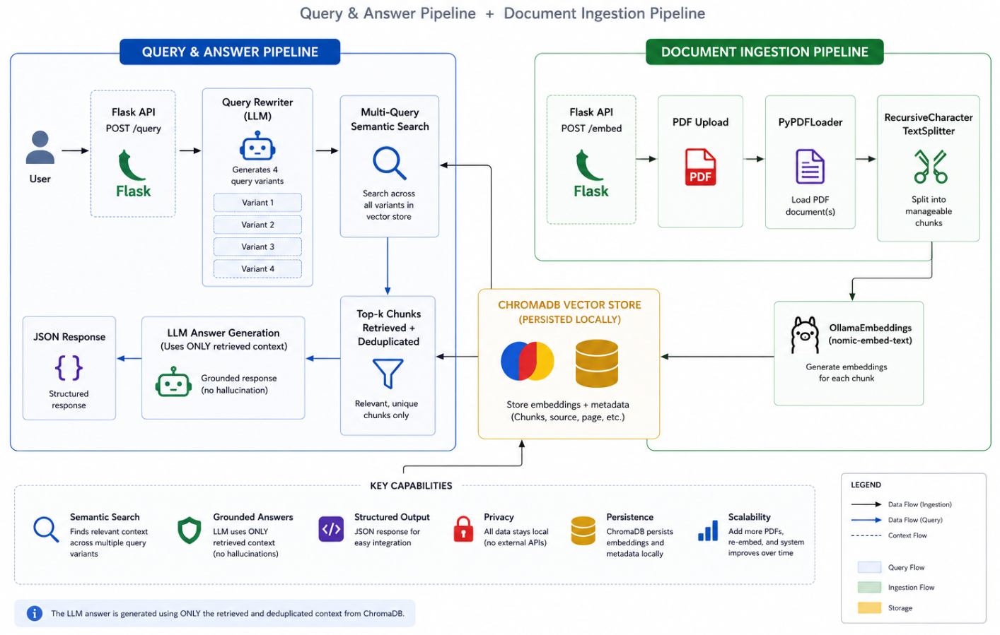

# Semantic Span

This project is a production-ready **Retrieval-Augmented Generation (RAG)** system designed to enable natural language interaction with PDF documents.

Users can upload one or more PDF files and query their contents directly using plain language. The system retrieves relevant sections from the documents and generates accurate, context-aware responses, eliminating the need for manual search or reading through large files.

The solution is built using Python, LangChain, ChromaDB, and Ollama, and runs entirely on a local machine. This ensures full data privacy, as no information is transmitted to external services or cloud-based APIs.

At its core, the system combines semantic search with a locally hosted large language model to deliver a secure, efficient, and self-contained document question-answering pipeline suitable for production use cases.

---

## Overview

Most LLMs hallucinate when asked about documents they've never seen. This project solves that by combining **vector search** with **language generation** — documents are chunked, embedded, and stored locally. When a query comes in, the most relevant chunks are retrieved first, then passed to the LLM as context. The model answers only from what's actually in your documents.

Everything runs locally via Ollama. No OpenAI key required.

---

## Architecture


---

## Tech Stack

| Layer | Technology |
|---|---|
| API Server | Flask |
| LLM Inference | Ollama (llama3.2:1b) |
| Embeddings | Ollama (nomic-embed-text) |
| Vector Store | ChromaDB |
| Orchestration | LangChain |
| PDF Parsing | PyPDF |

---

## Project Structure

```
semanticspan/
├── app.py              # Flask API — exposes /embed and /query endpoints
├── embed.py            # PDF ingestion pipeline (load → split → embed → store)
├── query.py            # Query pipeline (rewrite → retrieve → generate)
├── get_vector_db.py    # ChromaDB + OllamaEmbeddings setup
├── requirements.txt    # Python dependencies
├── .env                # Environment configuration
└── _temp/              # Temporary PDF storage during processing
```

---

## Getting Started

### Prerequisites

- Python 3.9+
- [Ollama](https://ollama.com) installed and running

### 1. Clone the repository

```bash
git clone https://github.com/your-username/semanticspan.git
cd end_to_end_rag
```

### 2. Create and activate a virtual environment

```bash
python -m venv rag_venv

# Windows
rag_venv\Scripts\activate

# macOS/Linux
source rag_venv/bin/activate
```

### 3. Install dependencies

```bash
pip install -r requirements.txt
```

### 4. Pull the required Ollama models

```bash
ollama pull llama3.2:1b
ollama pull nomic-embed-text
```

> **Note on RAM:** `llama3.2:1b` requires ~1.3 GiB of free memory. If you have 8+ GiB available, you can upgrade to `llama3.2` (full 3B model) in your `.env` for better reasoning quality.

### 5. Configure environment variables

Create a `.env` file in the project root:

```dotenv
TEMP_FOLDER=./_temp
CHROMA_PATH=chroma
COLLECTION_NAME=semanticspan
LLM_MODEL=llama3.2:1b
TEXT_EMBEDDING_MODEL=nomic-embed-text
OLLAMA_HOST=http://localhost:11434
```

### 6. Start the server

```bash
python app.py
```

The API will be available at `http://localhost:8080`.

---

## API Reference

### `POST /embed`

Upload a PDF to be chunked, embedded, and stored in the vector database.

**Request:** `multipart/form-data`

| Field | Type | Description |
|---|---|---|
| `file` | File | A `.pdf` document |

**Example:**
```bash
curl -X POST http://localhost:8080/embed \
  -F "file=@./your-document.pdf"
```

**Response:**
```json
{ "message": "File embedded successfully" }
```

---

### `POST /query`

Ask a question against the embedded documents.

**Request:** `application/json`

| Field | Type | Description |
|---|---|---|
| `query` | string | Your natural language question |

**Example:**
```bash
curl -X POST http://localhost:8080/query \
  -H "Content-Type: application/json" \
  -d '{"query": "What are the key skills listed in this CV?"}'
```

**Response:**
```json
{ "message": "Based on the document, the key skills listed are..." }
```

---

## How the Query Pipeline Works

A single query goes through two LLM calls:

1. **Query rewriting** — The LLM generates four variations of your original question. This improves recall by casting a wider semantic net across the vector store.
2. **Answer generation** — Retrieved chunks from all query variants are deduplicated and passed to the LLM as context. The model is instructed to answer strictly from that context, reducing hallucination.

---

## Configuration

| Variable | Default | Description |
|---|---|---|
| `LLM_MODEL` | `llama3.2:1b` | Ollama model used for generation |
| `TEXT_EMBEDDING_MODEL` | `nomic-embed-text` | Ollama model used for embeddings |
| `CHROMA_PATH` | `chroma` | Local directory for vector store persistence |
| `COLLECTION_NAME` | `end_to_end_rag` | ChromaDB collection name |
| `OLLAMA_HOST` | `http://localhost:11434` | Ollama server address |
| `TEMP_FOLDER` | `./_temp` | Temporary folder for uploaded PDFs |

---

## Requirements

```
flask
chromadb
langchain
langchain-community
langchain-ollama
langchain-chroma
langchain-text-splitters
pypdf
python-dotenv
requests
werkzeug
```

---

## Limitations

- PDF only — other document types (`.docx`, `.txt`) are not currently supported
- Single-user, single-threaded — not designed for concurrent requests in production
- The `_temp` folder is cleaned after each embed; originals are not retained
- ChromaDB runs in-process with file persistence — not suited for distributed deployments

---

## Potential Improvements

- Add support for `.txt`, `.docx`, and `.md` file types
- Stream responses from the `/query` endpoint using Server-Sent Events
- Add a simple frontend UI for non-technical users
- Swap ChromaDB for Qdrant or Weaviate for production-scale vector search
- Add document metadata tagging so queries can be scoped to specific files

---
